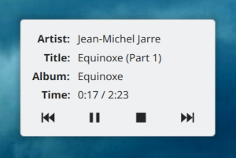

## MPD Now Playing

MPD Now Playing is a simple client plasmoid for the Music Player Daemon.

### How to install

Make sure you have libmpdclient installed (including development files).

Clone the repo or extract the downloaded archive, change to the extracted folder and type

    mkdir build && cd build
    cmake -DCMAKE_INSTALL_PREFIX=`qtpaths --install-prefix` ..
    make
    sudo make install

Feedback and translations are welcome.

**Enjoy!**

